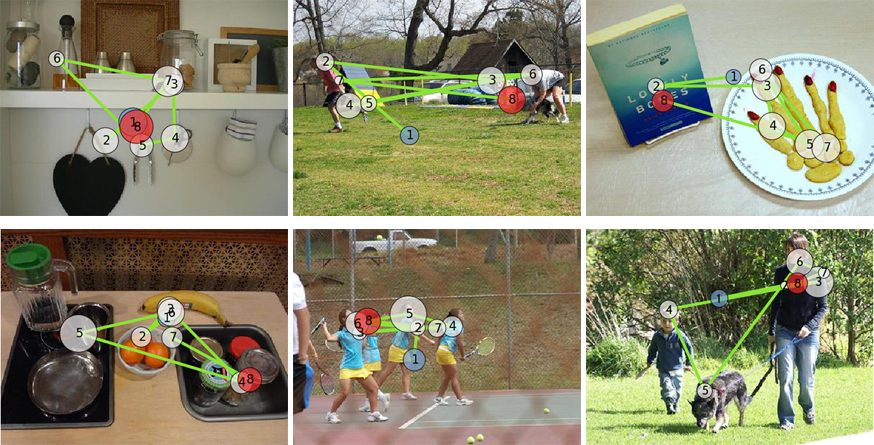

# Visual Scanpath Prediction
Pytorch implementation of the paper **"Visual Scanpath Prediction using IOR-ROI Recurrent Mixture Density Network"**

## Models

There are four major components presented in the model: an image feature extractor, the ROI generation module, the fixation duration prediction module and a saliency guidance network. Given an input image, the image feature extractor is responsible for extracting deep convolutional features and semantic features using off-the-shelf CNN architectures. The ROI generation module is composed of IOR-ROI LSTM and the MDN. The IOR-ROI LSTM plays a critical role in modeling the IOR dynamics and attention shift behavior. Instead of predicting a unique ROI in a deterministic manner for each step, the MDN is used to generate the distribution of ROIs as GMs. The next fixation is sampled from the mixture distribution of Gaussians to model the stochastic of human saccadic behavior. The fixation duration prediction module predicts fixation duration as a Gaussian distribution whose parameters are regressed by a fully connected neural network. The saliency guidance network is only employed during the training phase, encouraging the feature extractor to encode more saliency information in convolutional features.

## Run the code

To run the code, you need to download the pre-trained models from [here](#) and extract the files to the **data** folder in the root directory.

	# get the source code
	git clone https://github.com/sunwj/scanpath.git
	
	# run the code
	python3 eval.py -i image_file -s semantic_file
	
	# example
	python3 eval.py -i ./sample_images

The generated scanpaths are saved in the **results** folder.

## Sample results

We provide images and semantic features for the OSIE dataset which can be downloaded from [here](#). The semantic features are extracted using the [code and pre-trained models](https://github.com/ronghanghu/seg_every_thing), you can use the code to extract semantic features of other images.

# Code coming soon ...